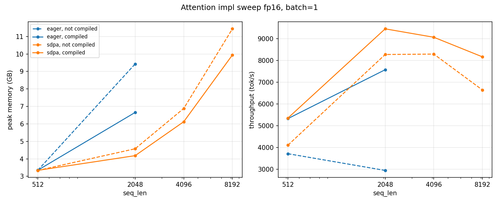

## Single-GPU benchmark (Colab T4, 16 GB / Kaggle 2 T4)

Все эксперименты на модели ~160M (12 слоёв, d_model=768, num_heads=12, d_ff=2048),
batch_size=2, seq_len=1024, attn=eager(сравнение с sdpa на attention sweep) если не указано иное. 
Замеры: 5 warmup + 10 measured итераций

дисклеймер(ы): 
- T4 не поддерживает bf16, поэтому mixed precision с fp16. строка с bf16 и ложна быть сильно хуже (но, конечно, если запускать на H100, то будет сильно лучше)
- в single_gpu_sweep attention - eager (с материализацией матрицы attention скоров), сравнение с sdpa из торча - ниже в attention sweep

### Воспроизведение

для построения всей таблицы:

```bash
bash start_benchmark_single_gpu_sweep.sh
```

для отдельных прогонов с изменение параметров:
```
uv run python -m src.bench_single_gpu --config_path configs/baseline_single_gpu_config.yaml --precision fp16
```

Результаты сохраняются в json в директории results/single_gpu_sweep

### Результаты

на baseline_config:
```
is_custom: false
attention_impl: eager

batch_size: 2
seq_len: 1024

precision: fp32
compile: false
grad_checkpoint_strat: none

warmup_iters: 5
measure_iters: 20
```

| config                                                                | forward ms         | backward ms       | peak GB | tokens/s |
| :-------------------------------------------------------------------- | :----------------- | :---------------- | :------ | :------- |
| baseline fp32 with custom layers                                      | 258.22 ± 69.672    | 536.839 ± 139.534 | 9.052   | 2412     |
| compiled baseline fp32 with custom layers                             | 231.863 ± 148.801  | 413.916 ± 318.343 | 7.282   | 2926     |
| baseline fp32                                                         | 236.869 ± 104.594  | 502.606 ± 135.466 | 8.849   | 2581     |
| compiled fp32                                                         | 227.81 ± 180.633   | 401.812 ± 494.487 | 7.28    | 2996     |
| baseline fp16                                                         | 124.016 ± 4.219    | 285.881 ± 69.731  | 6.981   | 4351     |
| compiled fp16                                                         | 52.289 ± 1.563     | 100.297 ± 45.512  | 5.402   | 9609     |
| baseline bf16 (not native on T4)                                      | 330.767 ± 111.035  | 703.116 ± 305.095 | 6.981   | 1870     |
| baseline fp32 with full checkpointing                                 | 264.591 ± 520.425  | 727.056 ± 25.299  | 3.73    | 1958     |
| fp16 with full checkpointing                                          | 125.08 ± 1090.095  | 385.17 ± 18.787   | 3.527   | 3586     |
| compiled fp16 with full checkpointing                                 | 123.006 ± 10.68    | 394.357 ± 142.458 | 3.527   | 3542     |
| baseline fp16 with SELECTIVE checkpointing                            | 127.276 ± 1234.028 | 378.294 ± 31.773  | 4.139   | 3615     |
| compiled fp16 with SELECTIVE checkpointing (attn block megatron vibe) | 117.367 ± 2.046    | 360.514 ± 49.355  | 3.92    | 3800     |


## Attention vs seq_len sweep (batch_size = 1, fp16)

Свип seq_len {512(~равно d_model, нет разницы между вариантами), 2048(больше d_model, появляется разница в метриках), 4096(OOM для eager, sdpa - держится), 8192(sdpa всё ещё в порядке)} для
конфигураций attention:

- **eager fp16** — ручной softmax(QKᵀ/√d)V`, материализуется `(B·H·S·S)`
  тензор скоров - память растёт как O(S²).
- **sdpa fp16** — `F.scaled_dot_product_attention`. На T4 это
  memory-efficient backend - почти линейный рост памяти по S.
- **eager fp16 compiled** — eager под torch.compile. Может ли compiled версия модели приблизиться по перформансу к sdpa
- **sdpa fp16** compiled — F.scaled_dot_product_attention с torch.compile для честного сравнения с eager compiled. 

### Воспроизведение

```bash
python -m benchmark.attention_sweep
```

Результаты в `results/attn_sweep/attention_sweep.json`. 


### Результаты

| seq_len | impl  | compile | peak_gb | fwd_ms  | bwd_ms  | tok/s | oom  |
| ------- | ----- | ------- | ------- | ------- | ------- | ----- | ---- |
| 512     | eager | no      | 3.352   | 27.104  | 110.825 | 3712  |      |
|         | eager | yes     | 3.353   | 13.979  | 82.137  | 5327  |      |
|         | sdpa  | no      | 3.338   | 26.253  | 98.533  | 4103  |      |
|         | sdpa  | yes     | 3.343   | 12.766  | 82.899  | 5352  |      |
| 2048    | eager | no      | 9.430   | 186.190 | 509.908 | 2942  |      |
|         | eager | yes     | 6.656   | 73.251  | 197.035 | 7577  |      |
|         | sdpa  | no      | 4.578   | 56.135  | 191.258 | 8278  |      |
|         | sdpa  | yes     | 4.184   | 42.579  | 173.936 | 9459  |      |
| 4096    | eager | no      | —       | —       | —       | —     | true |
|         | eager | yes     | —       | —       | —       | —     | true |
|         | sdpa  | no      | 6.886   | 128.734 | 364.945 | 8297  |      |
|         | sdpa  | yes     | 6.127   | 106.831 | 344.675 | 9072  |      |
| 8192    | eager | no      | —       | —       | —       | —     | true |
|         | eager | yes     | —       | —       | —       | —     | true |
|         | sdpa  | no      | 11.439  | 324.464 | 908.271 | 6645  |      |
|         | sdpa  | yes     | 9.943   | 262.153 | 740.570 | 8170  |      |


### Наблюдения

- eager упрётся в OOM раньше всех - уже на 4096 (при batch_size=1)
- SDPA не падает на 8192
- eager идентичен sdpa на коротких последовательностях, compiled не даёт преимущества по памяти но на 2048 - уже эффективен
- eager compiled обычно не догоняет SDPA по памяти, но может слегка
  сэкономить время

 
